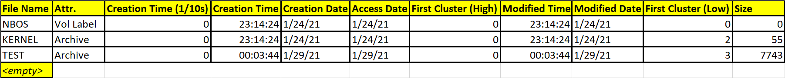

# Notes
- Directive:
    - Gives a clue to the assembler that will affect how the program gets compiled.
    - **NOT** translated to machine code!
    - Assembler specific: Different assemblers might have different directives.
- Instruction:
    - Translated to a machine code instruction that the CPU will execute.

- ORG:
    - Is a directive.
    - Tells assembler where we expect our code to be loaded.
    - The assembler uses this information to calculate label addresses.

- Bits:
    - Also a directive.
    - Tells assembler to emit 16/32/64 bit code.

- HLT:
    - Stops CPU from executing (it can be resumed by an interrupt).

- JMP <Location>:
    - Jumps to given location, unconditionally (equialent with "goto" instruction in C).

- DB <byte1>, <byte2>, <byte3>...:
    - Is a directive.
    - Stands for "define byte(s)".
    - Write4s given byte(s) to the assembled binary file.

- TIMES <number> <instruction/data>:
    - Is a directive.
    - Repeats given instruction or piece of data a number of times.

- $:
    - Special symbol which is equal to the memory offset of the current line.

- $-$$:
    - Gives the size of our program so far (in bytes).

- SW <word1>, <word2>, <word3>...:
    - Is a directive.
    - Stands for "define word(s)".
    - Writes given word(s) (2byte value, encoded in little endian) to the assembled binary file.

- LODSB, LODSW, LODSD:
    - These instructions load a byte/word/double-word from DS:SI into AL/AX/EAX, then increment by the number of bytes loaded.

- JZ:
    - Jump if the previous operation results 0.

- MOV <dst>, <src>:
    - Moves from source to destination.
    - This is equivalent to this statement in C: "dst = src;"

- REPE:
    - Repeate While Equal.
    - This repeate an instruction as long as the values are equal up to cx times.
    - All of this times, cx gets decremented.

- CMPSB:
    - Compare String Bytes.
    - Compares the two bytes located in memory at addresses ds:si and es:di.
    - si and di are incremented (when direction flag=0) or decremented (when direction flag=1).
    - Comparison is performed similarly to the CMP instruction - a subtraction is performed, and the flags are set accordingly.

- CMPSW, CMPSD, CMPSQ:
    - Like CMPSB but for words, double words, quads.

- Interrupts:
    - A signal which makes the processor stop what it's doing, in order to handle that signal.
    - Can be triggered by:
        - An exception (e.g. dividing by zero, segmentation fault, page fault)
        - Hardware (e.g. keyboard key pressed or released, timer tick, disk controller finished an operation)
        - Software (through the INT instruction)
    - Examples of BIOS Interrupts:
        - INT 10h -- Video
            - AH = 00h -- Set Video Mode
            - AH = 01h -- Set Cursor Shape
            - AH = 02h -- Set Cursor Position
            - AH = 03h -- Get Cursor Position And Shape
            - ...
            - AH = 0Eh -- Write Character in TTY Mode
                - Prints a character to the screen in TTY mode.
                - AH = 0E
                - AL = ASCII character to write
                - BH = page number (text modes)
                - BL = foreground pixel color (graphics modes)
                - return nothing
                - cursor advances after write
                - charactes BEL (7), BS (8), LF (A), and CR(D) are treated as control codes.
        - INT 11h -- Equipment Check
        - INT 12h -- Memory Size
        - INT 13h -- Disk I/O
        - INT 14h -- Serial Communications
        - INT 15h -- Cassette
        - INT 16h -- Keyboard I/O

- Most of the time, the OS is splitted in 2 parts, the bootloader and the kernel.
- Bootloader:
    - Loads basic components into memory.
    - Puts system in expected state.
    - Collects information about system.

- LBA to CHS conversion:
    - sectors per track/cylinder (on a single side)
    - heads per cylinder (or just heads)
    - sector = (LBA % sectors per track) + 1
    - head = (LBA / sectors per track) % heads
    - cylinder = (LBA / sectors per track) / heads

- FAT12 File System:
    - Divided in 4 regions.
    - Reserved:
        - Contains info about the size of a sector, the size and location of each other region as well some other metadata about the disk like the volume id, label and stuff.
        - The bootloader is stored in this region.
        - The difference with FAT32 is that it uses an additional sector to store these headers called "File System Information Sector" but this is not present in FAT12 and FAT16.
    - File Allocation Tables:
        - Contains 2 copies of the file allocation table.
        - This is a simple lookup table that give us the location of the next block of data.
    - Root Directory:
        - Contains the root directory.
        - This is basically the table of contents of the disk.
        - It contains entries for each file or folder located in the root of the disk.
        - This table contains things like:
            - File name.
            - Location of the file on the disk.
            - The size.
            - The attributes.
            - Other metadata.
    - Data:
        - Contains the actual content of the files as well of other directories.

## Root Directory Table

- The filename is max 11 chars.
- To understand where we can find the kernel file in the disk we do some math:
    - Convert to Sector Number: LBA = data_region_begin + (cluster - 2) * sector_per_cluster
    - The cluster in FAT12, we're interested only on the low first cluster, because it represents the first 16 bits.
    - In this case, the "cluster" it's equal to 3.
    - In our case, data_region_begin is 1 (reserved) + 18 (file allocation tables) + 14 (root directory), the cluster is 3, and sectors_per_cluster is 2.
    - LBA = 35